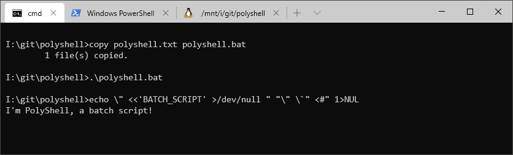
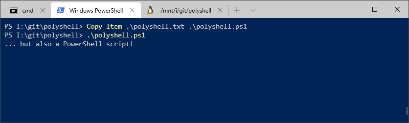
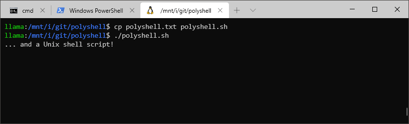

## PolyShell: a Bash/Batch/PowerShell polyglot

## What It Is

PolyShell is a script that's simultaneously valid in Bash, Windows Batch, and PowerShell (i.e. a [polyglot](https://en.wikipedia.org/wiki/Polyglot_(computing))).

This makes PolyShell a useful template for penetration testing as it can be executed on most systems without the need for target-specific payloads.  PolyShell is also specifically designed to be deliverable via input injection using a [USB Rubby Ducky](https://shop.hak5.org/collections/usb-rubber-ducky/products/usb-rubber-ducky-deluxe), [MalDuino](https://malduino.com/), or similar device.

## How To Use It

### As a stand-alone script

1. Copy/rename the script so it has the correct file extension (`.sh`, `.bat`, or `.ps1`).
1. Run the script with a Unix shell, as a batch file, or with PowerShell.

### Using input injection

1. Open a terminal on the target machine.
1. Run the payload.
1. Press Ctrl-C, then run `exit`.

The input injection method will behave slightly differently than the script method.  When run as a script, the payload will exit immediately once a language has been processed.  When delivered via injection, the payload runs a read loop instead.  Without it, the payload would close the terminal window but continue typing into an unknown window instead.  The Ctrl-C breaks the script out of the read loop, allowing it run without unintended side-effects.

Additionally, _pasting_ the script into a terminal might fail.  Once the script reaches the read loop, some terminals will treat the remaining pasted text as the read loop's input (good), but others may continue executing the script when the read loop exits (bad).

## How It Works

The main trick is to get each other language to "look away" when we want to run code specific to only one of them.  This is accomplished by exploiting language quirks surrounding quoting, redirection, and comments.  
Consider the following line:

    echo \" <<'BATCH_SCRIPT' >/dev/null ">NUL "\" \`" <#"

Each language sees the `echo` command, but will interpret the rest of the line differently.  
For example, this is what each language will interpret as a string:

          echo \" <<'BATCH_SCRIPT' >/dev/null ">NUL "\" \`" <#"
    Bash                                      [-----]     [---]
    Batch       [-----------------------------]     [-]   [---]
    PS          [-----------------------------]     [-]

After executing the line, the bash script will be in a [here document](https://www.tldp.org/LDP/abs/html/here-docs.html), PowerShell script will be in a [multiline-comment](https://ss64.com/ps/syntax-comments.html), and the batch script will continue executing normally.  After each language is done executing, we terminate it.  This prevents us from needing to work around its quirks later in the script.

### Quirks

Obviously, the tricks required to make this polyglot doesn't follow _normal_ coding conventions.  
There are quite a few quirks that were leveraged or had to be worked around:

- All three languages have different escape characters:
  - Bash: backslash (`\`)
  - Batch: caret (`^`)
  - PowerShell: backtick (`` ` ``)
- Escape characters work inside Bash and PowerShell strings, but not batch strings.
- Redirects (i.e. `<` and `>`) have special meaning in all three languages unless quoted.
- Redirects don't have to be at the end of a command.  
  - This is valid Bash/Batch/PowerShell: `echo >output.txt "Hello World"`
- Batch is the only language _without_ multi-line strings or comments.
- Batch treats `>` as a redirect even when it directly touches a string, but PowerShell doesn't.
- Batch script `GOTO` statements only work when run as a script, not when run interactively.
- PowerShell's multi-line comment (`<#`) must be immediately preceded by whitespace.
- Bash's here documents may begin *anywhere* so long as it's unquoted and not a comment.
